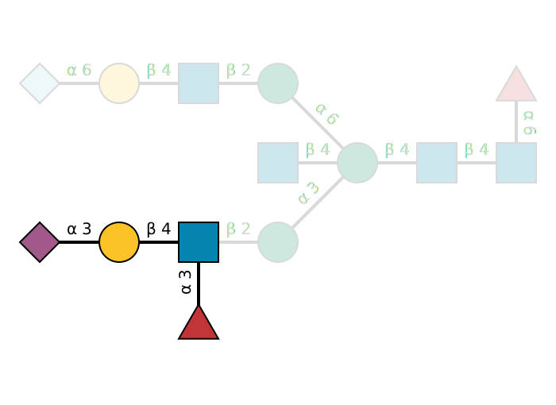

# glycowork


<!-- WARNING: THIS FILE WAS AUTOGENERATED! DO NOT EDIT! -->


[](https://github.com/BojarLab/glycowork/issues)[](https://zenodo.org/doi/10.5281/zenodo.10039202)[](https://codecov.io/gh/BojarLab/glycowork)


Glycans are fundamental biological sequences that are as crucial as DNA,
RNA, and proteins. As complex carbohydrates forming branched structures,
glycans are ubiquitous yet often overlooked in biological research.

## Why Glycans are Important

- Ubiquitous in biology
- Integral to protein and lipid function
- Relevant to human diseases

## Challenges in Glycan Analysis

Analyzing glycans is complicated due to their non-linear structures and
enormous diversity. But that’s where `glycowork` comes in.

## Introducing glycowork: Your Solution for Glycan-Focused Data Science

Glycowork is a Python package specifically designed to simplify glycan
sequence processing and analysis. It offers:

- Functions for glycan analysis
- Datasets for model training
- Full support for IUPAC-condensed string representation. Broad support
  for IUPAC-extended, LinearCode, Oxford, GlycoCT, WURCS, GLYCAM, and
  GlycoWorkBench.
- Powerful graph-based architecture for in-depth analysis

**Documentation:** <https://bojarlab.github.io/glycowork/>

**Contribute:** Interested in contributing? Read our [Contribution
Guidelines](https://github.com/BojarLab/glycowork/blob/master/CONTRIBUTING.md)

**Citation:** If `glycowork` adds value to your project, please cite
[Thomes et al.,
2021](https://academic.oup.com/glycob/advance-article/doi/10.1093/glycob/cwab067/6311240)

## Install

<u>Not familiar with Python?</u> Try our no-code, graphical user
interface (`glycoworkGUI.exe`, can be downloaded at the bottom of the
latest [Release](https://github.com/BojarLab/glycowork/releases) page)
for accessing some of the most useful `glycowork` functions!

<u>via pip:</u> <br> `pip install glycowork` <br> `import glycowork`

<u>alternative:</u> <br>
`pip install git+https://github.com/BojarLab/glycowork.git` <br>
`import glycowork`

<u>Note that we have optional extra installs for specialized use (even
further instructions can be found in the `Examples` tab; on Mac you
might need to use `"glycowork[draw]"`), such as:</u> <br> *deep
learning* <br> `pip install glycowork[ml]` <br> *drawing glycan images
with GlycoDraw (see install instructions in the `Examples` tab)* <br>
`pip install glycowork[draw]` <br> *analyzing atomic/chemical properties
of glycans* <br> `pip install glycowork[chem]` <br> *everything* <br>
`pip install glycowork[all]` <br>

## Data & Models

`Glycowork` currently contains the following main datasets that are
freely available to everyone:

- **`df_glycan`**
  - contains ~50,500 unique glycan sequences, including labels such as
    ~39,500 species associations, ~19,000 tissue associations, and
    ~2,500 disease associations
- **`glycan_binding`**
  - contains \>580,000 protein-glycan binding interactions, from 1,465
    unique glycan-binding proteins

Additionally, we store these trained deep learning models for easy
usage, which can be retrieved with the `prep_model` function:

- **`LectinOracle`**
  - can be used to predict glycan-binding specificity of a protein,
    given its ESM-1b representation; from [Lundstrom et al.,
    2021](https://onlinelibrary.wiley.com/doi/10.1002/advs.202103807)
- **`LectinOracle_flex`**
  - operates the same as LectinOracle but can directly use the raw
    protein sequence as input (no ESM-1b representation required)
- **`SweetNet`**
  - a graph convolutional neural network trained to predict species from
    glycan, can be used to generate learned glycan representations; from
    [Burkholz et al., 2021](https://pubmed.ncbi.nlm.nih.gov/34133929/)
- **`NSequonPred`**
  - given the ESM-1b representation of an N-sequon (+/- 20 AA), this
    model can predict whether the sequon will be glycosylated

## How to use

`Glycowork` currently contains four main modules:

- **`glycan_data`**
  - stores several glycan datasets and contains helper functions
- **`ml`**
  - here are all the functions for training and using machine learning
    models, including train-test-split, getting glycan representations,
    etc.
- **`motif`**
  - contains functions for processing & drawing glycan sequences,
    identifying motifs and features, and analyzing them
- **`network`**
  - contains functions for constructing and analyzing glycan networks
    (e.g., biosynthetic networks)

Below are some examples of what you can do with `glycowork`; be sure to
check out the other `examples` in the full documentation for everything
that’s there. [–\> Learn more](./05_examples.ipynb) A non-exhaustive
list includes:

- using trained AI models for prediction [–\> Learn
  more](./02_ml.ipynb#inference)
- training your own AI models [–\> Learn
  more](./02_ml.ipynb#model_training)
- motif enrichment analyses [–\> Learn more](./03_motif.ipynb#analysis)
- differential glycomics expression analysis [–\> Learn
  more](./03_motif.ipynb#analysis)
- annotating motifs in glycans [–\> Learn
  more](./03_motif.ipynb#annotate)
- drawing publication-quality glycan figures [–\> Learn
  more](./03_motif.ipynb#draw)
- finding out whether & where glycans are describing the same sequence
  [–\> Learn more](./03_motif.ipynb#graph)
- *m/z* to composition to structure to motif mappings [–\> Learn
  more](./03_motif.ipynb#tokenization)
- mass calculation [–\> Learn more](./03_motif.ipynb#tokenization)
- visualizing motif distribution / glycan similarities / sequence
  properties [–\> Learn more](./03_motif.ipynb#analysis)
- constructing and analyzing biosynthetic networks [–\> Learn
  more](./04_network.ipynb#biosynthesis)

``` python
#drawing publication-quality glycan figures
from glycowork import GlycoDraw
GlycoDraw("Neu5Ac(a2-3)Gal(b1-4)[Fuc(a1-3)]GlcNAc(b1-2)Man(a1-3)[Neu5Gc(a2-6)Gal(b1-4)GlcNAc(b1-2)Man(a1-6)][GlcNAc(b1-4)]Man(b1-4)GlcNAc(b1-4)[Fuc(a1-6)]GlcNAc", highlight_motif = "Neu5Ac(a2-3)Gal(b1-4)[Fuc(a1-3)]GlcNAc")
```



``` python
#get motifs, graph features, and sequence features of a set of glycan sequences to train models or analyze glycan properties
glycans = ["Neu5Ac(a2-3)Gal(b1-4)[Fuc(a1-3)]GlcNAc(b1-2)Man(a1-3)[Gal(b1-3)[Fuc(a1-4)]GlcNAc(b1-2)Man(a1-6)]Man(b1-4)GlcNAc(b1-4)[Fuc(a1-6)]GlcNAc",
           "Ma3(Ma6)Mb4GNb4GN;N",
           "α-D-Manp-(1→3)[α-D-Manp-(1→6)]-β-D-Manp-(1→4)-β-D-GlcpNAc-(1→4)-β-D-GlcpNAc-(1→",
           "F(3)XA2",
           "WURCS=2.0/5,11,10/[a2122h-1b_1-5_2*NCC/3=O][a1122h-1b_1-5][a1122h-1a_1-5][a2112h-1b_1-5][a1221m-1a_1-5]/1-1-2-3-1-4-3-1-4-5-5/a4-b1_a6-k1_b4-c1_c3-d1_c6-g1_d2-e1_e4-f1_g2-h1_h4-i1_i2-j1",
           """RES
1b:b-dglc-HEX-1:5
2s:n-acetyl
3b:b-dglc-HEX-1:5
4s:n-acetyl
5b:b-dman-HEX-1:5
6b:a-dman-HEX-1:5
7b:b-dglc-HEX-1:5
8s:n-acetyl
9b:b-dgal-HEX-1:5
10s:sulfate
11s:n-acetyl
12b:a-dman-HEX-1:5
13b:b-dglc-HEX-1:5
14s:n-acetyl
15b:b-dgal-HEX-1:5
16s:n-acetyl
LIN
1:1d(2+1)2n
2:1o(4+1)3d
3:3d(2+1)4n
4:3o(4+1)5d
5:5o(3+1)6d
6:6o(2+1)7d
7:7d(2+1)8n
8:7o(4+1)9d
9:9o(-1+1)10n
10:9d(2+1)11n
11:5o(6+1)12d
12:12o(2+1)13d
13:13d(2+1)14n
14:13o(4+1)15d
15:15d(2+1)16n"""]
from glycowork.motif.annotate import annotate_dataset
out = annotate_dataset(glycans, feature_set = ['known', 'terminal', 'exhaustive'], condense=True)
```

|  | Internal_LewisX | SialylLewisX | Terminal_LewisA | H_antigen_type2 | Chitobiose | Trimannosylcore | Terminal_LacNAc_type1 | Internal_LacNAc_type2 | Terminal_LacNAc_type2 | Terminal_LacdiNAc_type2 | core_fucose | core_fucose(a1-3) | Nglycan_complex | Nglycan_complex2 | M3FX | Fuc | Gal | GalNAc | GalNAcOS | GlcNAc | Man | Neu5Ac | Xyl | Fuc(a1-2)Gal | Fuc(a1-3)GlcNAc | Fuc(a1-4)GlcNAc | Fuc(a1-6)GlcNAc | Fuc(a1-?)GlcNAc | Gal(b1-3)GlcNAc | Gal(b1-4)GlcNAc | Gal(b1-?)GlcNAc | GalNAc(b1-4)GlcNAc | GalNAcOS(b1-4)GlcNAc | GlcNAc(b1-2)Man | GlcNAc(b1-4)GlcNAc | GlcNAc(b1-?)Man | Man(a1-3)Man | Man(a1-6)Man | Man(a1-?)Man | Man(b1-4)GlcNAc | Neu5Ac(a2-3)Gal | Xyl(b1-2)Man | Terminal_Neu5Ac(a2-3) | Terminal_Gal(b1-3) | Terminal_Man(a1-3) | Terminal_Gal(b1-4) | Terminal_GalNAc(b1-4) | Terminal_Fuc(a1-3) | Terminal_Man(a1-6) | Terminal_GalNAcOS(b1-4) | Terminal_Fuc(a1-4) | Terminal_Xyl(b1-2) | Terminal_Fuc(a1-6) | Terminal_Fuc(a1-2) | Terminal_Man(a1-?) | Terminal_Fuc(a1-?) | Terminal_Gal(b1-?) | Terminal_GlcNAc(b1-?) |
|----|----|----|----|----|----|----|----|----|----|----|----|----|----|----|----|----|----|----|----|----|----|----|----|----|----|----|----|----|----|----|----|----|----|----|----|----|----|----|----|----|----|----|----|----|----|----|----|----|----|----|----|----|----|----|----|----|----|----|
| Neu5Ac(a2-3)Gal(b1-4)\[Fuc(a1-3)\]GlcNAc(b1-2)Man(a1-3)\[Gal(b1-3)\[Fuc(a1-4)\]GlcNAc(b1-2)Man(a1-6)\]Man(b1-4)GlcNAc(b1-4)\[Fuc(a1-6)\]GlcNAc | 1 | 1 | 1 | 0 | 1 | 1 | 1 | 1 | 0 | 0 | 1 | 0 | 1 | 0 | 0 | 3 | 2 | 0 | 0 | 4 | 3 | 1 | 0 | 0 | 1 | 1 | 1 | 3 | 1 | 1 | 2 | 0 | 0 | 2 | 1 | 2 | 1 | 1 | 2 | 1 | 1 | 0 | 1 | 1 | 0 | 0 | 0 | 1 | 0 | 0 | 1 | 0 | 1 | 0 | 0 | 3 | 1 | 0 |
| Man(a1-3)\[Man(a1-6)\]Man(b1-4)GlcNAc(b1-4)GlcNAc | 0 | 0 | 0 | 0 | 1 | 1 | 0 | 0 | 0 | 0 | 0 | 0 | 0 | 0 | 0 | 0 | 0 | 0 | 0 | 2 | 3 | 0 | 0 | 0 | 0 | 0 | 0 | 0 | 0 | 0 | 0 | 0 | 0 | 0 | 1 | 0 | 1 | 1 | 2 | 1 | 0 | 0 | 0 | 0 | 1 | 0 | 0 | 0 | 1 | 0 | 0 | 0 | 0 | 0 | 2 | 0 | 0 | 0 |
| Man(a1-3)\[Man(a1-6)\]Man(b1-4)GlcNAc(b1-4)GlcNAc | 0 | 0 | 0 | 0 | 1 | 1 | 0 | 0 | 0 | 0 | 0 | 0 | 0 | 0 | 0 | 0 | 0 | 0 | 0 | 2 | 3 | 0 | 0 | 0 | 0 | 0 | 0 | 0 | 0 | 0 | 0 | 0 | 0 | 0 | 1 | 0 | 1 | 1 | 2 | 1 | 0 | 0 | 0 | 0 | 1 | 0 | 0 | 0 | 1 | 0 | 0 | 0 | 0 | 0 | 2 | 0 | 0 | 0 |
| GlcNAc(b1-?)Man(a1-3)\[GlcNAc(b1-?)Man(a1-6)\]\[Xyl(b1-2)\]Man(b1-4)GlcNAc(b1-4)\[Fuc(a1-3)\]GlcNAc | 0 | 0 | 0 | 0 | 1 | 1 | 0 | 0 | 0 | 0 | 0 | 1 | 1 | 1 | 1 | 1 | 0 | 0 | 0 | 4 | 3 | 0 | 1 | 0 | 1 | 0 | 0 | 1 | 0 | 0 | 0 | 0 | 0 | 0 | 1 | 2 | 1 | 1 | 2 | 1 | 0 | 1 | 0 | 0 | 0 | 0 | 0 | 1 | 0 | 0 | 0 | 1 | 0 | 0 | 0 | 1 | 0 | 2 |
| Fuc(a1-2)Gal(b1-4)GlcNAc(b1-2)Man(a1-6)\[Gal(b1-4)GlcNAc(b1-2)Man(a1-3)\]Man(b1-4)GlcNAc(b1-4)\[Fuc(a1-6)\]GlcNAc | 0 | 0 | 0 | 1 | 1 | 1 | 0 | 1 | 1 | 0 | 1 | 0 | 1 | 0 | 0 | 2 | 2 | 0 | 0 | 4 | 3 | 0 | 0 | 1 | 0 | 0 | 1 | 1 | 0 | 2 | 2 | 0 | 0 | 2 | 1 | 2 | 1 | 1 | 2 | 1 | 0 | 0 | 0 | 0 | 0 | 1 | 0 | 0 | 0 | 0 | 0 | 0 | 1 | 1 | 0 | 2 | 1 | 0 |
| GalNAcOS(b1-4)GlcNAc(b1-2)Man(a1-3)\[GalNAc(b1-4)GlcNAc(b1-2)Man(a1-6)\]Man(b1-4)GlcNAc(b1-4)GlcNAc | 0 | 0 | 0 | 0 | 1 | 1 | 0 | 0 | 0 | 1 | 0 | 0 | 1 | 0 | 0 | 0 | 0 | 1 | 1 | 4 | 3 | 0 | 0 | 0 | 0 | 0 | 0 | 0 | 0 | 0 | 0 | 1 | 1 | 2 | 1 | 2 | 1 | 1 | 2 | 1 | 0 | 0 | 0 | 0 | 0 | 0 | 1 | 0 | 0 | 1 | 0 | 0 | 0 | 0 | 0 | 0 | 0 | 0 |

``` python
#using graphs, you can easily check whether a glycan contains a specific motif; how about internal Lewis A/X motifs?
from glycowork.motif.graph import subgraph_isomorphism
print(subgraph_isomorphism('Neu5Ac(a2-3)Gal(b1-4)[Fuc(a1-3)]GlcNAc(b1-6)[Gal(b1-3)]GalNAc',
                     'Fuc(a1-?)[Gal(b1-?)]GlcNAc', termini_list = ['terminal', 'internal', 'flexible']))
print(subgraph_isomorphism('Neu5Ac(a2-3)Gal(b1-3)[Fuc(a1-4)]GlcNAc(b1-6)[Gal(b1-3)]GalNAc',
                     'Fuc(a1-3/4)[Gal(b1-3/4)]GlcNAc', termini_list = ['t', 'i', 'f']))
print(subgraph_isomorphism('Gal(b1-3)[Fuc(a1-4)]GlcNAc(b1-6)[Gal(b1-3)]GalNAc',
                     'dHex(a1-?)[Hex(b1-?)]GlcNAc', termini_list = ['t', 'i', 'f']))

#or you could find the terminal epitopes of a glycan
from glycowork.motif.annotate import get_terminal_structures
print("\nTerminal structures:")
print(get_terminal_structures('Man(a1-3)[Man(a1-6)]Man(b1-4)GlcNAc(b1-4)[Fuc(a1-6)]GlcNAc'))
```

    True
    True
    False

    Terminal structures:
    ['Man(a1-3)', 'Man(a1-6)', 'Fuc(a1-6)']

``` python
#given a composition, find matching glycan structures in SugarBase; specific for glycan classes and taxonomy
from glycowork.motif.tokenization import compositions_to_structures
print(compositions_to_structures([{'Hex':3, 'HexNAc':4}], glycan_class = 'N'))

#or we could calculate the mass of this composition
from glycowork.motif.tokenization import composition_to_mass
print("\nMass of the composition Hex3HexNAc4")
print(composition_to_mass({'Hex':3, 'HexNAc':4}))
print(composition_to_mass("H3N4"))
print(composition_to_mass("Hex3HexNAc4"))
```

    0 compositions could not be matched. Run with verbose = True to see which compositions.
                                                   glycan  abundance
    0   GlcNAc(b1-2)Man(a1-3)[GlcNAc(b1-2)Man(a1-6)]Ma...          0
    1   GlcNAc(b1-2)Man(a1-3)[GlcNAc(b1-4)][Man(a1-6)]...          0
    2   GlcNAc(b1-2)[GlcNAc(b1-4)]Man(a1-3)[Man(a1-6)]...          0
    3   GalNAc(b1-4)GlcNAc(b1-2)Man(a1-3)[Man(a1-6)]Ma...          0
    4   GlcNAc(b1-2)Man(a1-6)[Man(a1-3)][GlcNAc(b1-4)]...          0
    5   Man(a1-3)[GlcNAc(b1-2)Man(a1-6)][GlcNAc(b1-4)]...          0
    6   GlcNAc(?1-?)Man(a1-3)[GlcNAc(b1-?)Man(a1-6)]Ma...          0
    7   GlcNAc(b1-2)Man(a1-3)[GlcNAc(b1-6)Man(a1-6)]Ma...          0
    8   GlcNAc(b1-4)Man(a1-3)[GlcNAc(b1-6)Man(a1-6)]Ma...          0
    9   GlcNAc(b1-2)Man(a1-3)[GlcNAc(b1-2)Man(a1-6)][G...          0
    10  GlcNAc(b1-2)Man(a1-3)[GlcNAc(b1-2)[GlcNAc(b1-4...          0
    11  GlcNAc(b1-2)[GlcNAc(b1-4)]Man(a1-3)[GlcNAc(b1-...          0
    12  GlcNAc(b1-4)Man(a1-3)[GlcNAc(b1-2)Man(a1-6)]Ma...          0
    13  Man(a1-3)[GlcNAc(b1-2)[GlcNAc(b1-6)]Man(a1-6)]...          0
    14  GalNAc(b1-4)GlcNAc(b1-2)Man(a1-6)[Man(a1-3)]Ma...          0

    Mass of the composition Hex3HexNAc4
    1316.4865545999999
    1316.4865545999999
    1316.4865545999999
