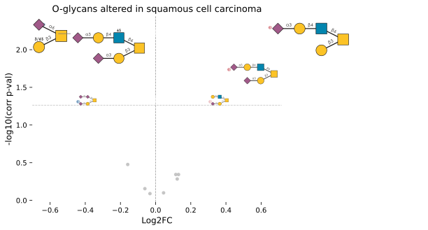
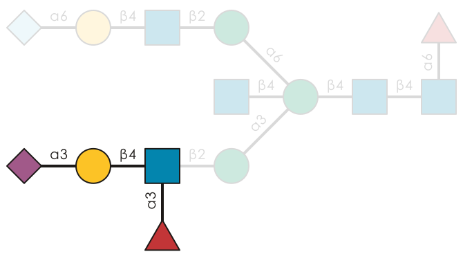
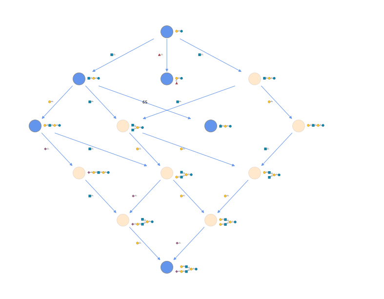

# glycowork


<!-- WARNING: THIS FILE WAS AUTOGENERATED! DO NOT EDIT! -->


[](https://pypi.org/project/glycowork/)[](https://pypi.org/project/glycowork/)
[](https://pypi.org/project/glycowork/)[](https://github.com/BojarLab/glycowork/issues)[](https://zenodo.org/doi/10.5281/zenodo.10039202)[](https://codecov.io/gh/BojarLab/glycowork)


`glycowork` is the Python package for glycan data science. Glycans are
branched, non-linear sequences with a dozen competing text
representations and no shared tooling, which is why most glycomics
analysis stalls before it starts. `glycowork` removes that step and
gives you the rest of the stack on top of it.

- **Reads everything.** IUPAC-condensed is native to `glycowork`.
  IUPAC-extended, GlycoCT, GlycoCT-XML, WURCS, LinearCode, Oxford,
  GLYCAM, CSDB-linear, GlycoWorkBench, GlyTouCan IDs, KCF, SMILES,
  pGlyco, and GlySeeker are canonicalized on the way in. You never need
  a parser again.
- **Graph-native.** Every glycan is a directed graph, so motif search is
  subgraph isomorphism with wildcards (`Hex`, `b1-3/4`, `?`),
  terminal/internal constraints, and negation. There is also a full
  regular-expression engine for glycans.
- **Statistics that comparative glycomics actually needs.**
  Compositional transforms, MNAR-aware imputation, two-stage FDR across
  motif families, effect sizes, ANOVA, time series, and biodiversity,
  each in one call.
- **Data included.** 50,461 curated glycan sequences with
  species/tissue/disease annotations, \>790,000 protein-glycan binding
  measurements, 72 analysis-ready glycomics, glycoproteomics, and
  lectin-array datasets, and four pretrained deep learning models.
- **Publication-ready figures.** SNFG drawings from a sequence, dropped
  straight into your volcano plots, heatmaps, and Excel sheets.

**Documentation:** <https://bojarlab.github.io/glycowork/> ·
**Contribute:**
[Guidelines](https://github.com/BojarLab/glycowork/blob/master/CONTRIBUTING.md)
· **Cite:** [Thomes et al.,
2021](https://academic.oup.com/glycob/advance-article/doi/10.1093/glycob/cwab067/6311240)

## Install

<u>Not familiar with Python?</u> Try our no-code, graphical user
interface (`glycoworkGUI.exe`, can be downloaded at the bottom of the
latest [Release](https://github.com/BojarLab/glycowork/releases) page)
for accessing some of the most useful `glycowork` functions

Or try our [web interface](https://canonicalize.streamlit.app/) for
sequence format conversion/cleaning and drawing glycan SNFG structures!

<u>via pip:</u> <br> `pip install glycowork` <br> `import glycowork`

<u>alternative:</u> <br>
`pip install git+https://github.com/BojarLab/glycowork.git` <br>
`import glycowork`

<u>Note that we have optional extra installs for specialized use (even
further instructions can be found in the `Examples` tab; on Mac you
might need to use `"glycowork[ml]"`), such as:</u> <br> *deep learning*
<br> `pip install glycowork[ml]` <br> *analyzing atomic/chemical
properties of glycans* <br> `pip install glycowork[chem]` <br>
*everything* <br> `pip install glycowork[all]` <br>

## Whole workflows in one call

An entire differential glycomics analysis, on real data that ships with
the package.

``` python
#matched tumor and healthy skin from 10 squamous cell carcinoma patients; one of 72 bundled datasets
from glycowork.glycan_data.loader import glycomics_data_loader
from glycowork.motif.analysis import get_differential_expression
df = glycomics_data_loader.human_skin_O_PMC5871710_SCC
print(df.groups)
#groups, pairing, and the alpha level are read off the dataset itself
res = get_differential_expression(df)
print(res.sort_values('corr p-val')[['Glycan', 'Log2FC', 'corr p-val', 'Effect size']].head())

#the same result object, drawn: every dot past the thresholds gets its SNFG structure instead of a text label
from glycowork.motif.analysis import get_volcano
get_volcano(res, annotate_volcano = True, title = 'O-glycans altered in squamous cell carcinoma')
```

    healthy (n=10) | cancer (n=10)
                                                   Glycan    Log2FC  corr p-val  \
    3                   Gal3/6S(b1-3)[Neu5Ac(a2-6)]GalNAc -0.636997    0.004645   
    9   Neu5Ac(a2-3)Gal(b1-4)GlcNAc(b1-6)[Gal(b1-3)]Ga...  0.652277    0.005088   
    12  Neu5Ac(a2-3)Gal(b1-4)GlcNAc6S(b1-6)[Neu5Ac(a2-... -0.554030    0.006128   
    10  Neu5Ac(a2-3)Gal(b1-4)GlcNAc(b1-6)[Neu5Ac(a2-3)...  0.418637    0.018367   
    5   Neu5Ac(a2-3)Gal(b1-3)[Gal(b1-4)GlcNAc(b1-6)]Ga...  0.311394    0.049055   

        Effect size  
    3     -1.359690  
    9      1.130819  
    12    -1.138143  
    10     1.045616  
    5      0.911243  



## Data & Models

`Glycowork` currently contains the following main datasets that are
freely available to everyone:

- **`df_glycan`**
  - contains ~50,500 unique glycan sequences, including labels such as
    ~39,500 species associations, ~20,000 tissue associations, and
    ~1,000 disease associations
- **`glycan_binding`**
  - contains \>790,000 protein-glycan binding interactions, from \>2,000
    unique glycan-binding proteins
- **`glycomics_data_loader`**, **`lectin_array_data_loader`**,
  **`glycoproteomics_data_loader`**
  - 72 curated, analysis-ready datasets from the literature, each
    shipping with its own sample groups, pairing, and provenance, so
    every analysis function below runs on them with no arguments

These are not flat tables; they query themselves:

``` python
#which glycans of odd-toed ungulates carry a3-sialylated LacNAc, and where were they described?
from glycowork.glycan_data.loader import df_glycan, glycomics_data_loader
hits = df_glycan.meta_filter(Order = 'Perissodactyla').glyco_filter('Sia(a2-3)Gal')
print(len(hits), hits.glycans[:3])

#which bundled O-glycomics datasets came from primary tissue or body fluid?
print(glycomics_data_loader.filter(glycan_class = 'O', source_type = ['primary tissue', 'body fluid']))
```

    84 ['Neu5Ac(a2-3)Gal(b1-4)Glc1Cer', 'Neu5Ac(a2-3)Gal(b1-3)GalNAc(b1-4)[Neu5Ac(a2-3)]Gal(b1-4)Glc1Cer', 'Neu5Ac(a2-8)Neu5Ac(a2-3)Gal(b1-4)Glc1Cer']
    ['fish_gill_infection_O_PMID41435595', 'fish_intestine_infection_O_10_2139ssrn_7005880', 'human_colorectal_O_PMC9254241', 'human_colorectal_O_PMID19152289', 'human_gastric_O_PMC5762837', 'human_gastric_O_PMID28461410', 'human_liver_O_PMC5383776', 'human_liver_O_PMC9254241', 'human_ovarian_O_PMC4468167', 'human_prostate_O_PMC8010466', 'human_skin_O_PMC5871710', 'human_skin_O_PMC5871710_BCC', 'human_skin_O_PMC5871710_SCC', 'mouse_brain_O_PMID38343116', 'mouse_brain_tango2ko_O_10_1002pgr2_70042', 'mouse_gastric_O_PMID40667878']

Additionally, we store these trained deep learning models for easy
usage, which can be retrieved with the `prep_model` function:

- **`LectinOracle`**
  - can be used to predict glycan-binding specificity of a protein,
    given its ESMC representation; from [Lundstrom et al.,
    2021](https://onlinelibrary.wiley.com/doi/10.1002/advs.202103807)
- **`LectinOracle_flex`**
  - operates the same as LectinOracle but can directly use the raw
    protein sequence as input (no ESMC representation required)
- **`SweetNet`**
  - a graph convolutional neural network trained to predict species from
    glycan, can be used to generate learned glycan representations; from
    [Burkholz et al., 2021](https://pubmed.ncbi.nlm.nih.gov/34133929/)
- **`NSequonPred`**
  - given the ESM-1b representation of an N-sequon (+/- 20 AA), this
    model can predict whether the sequon will be glycosylated

## How to use

Four modules:
[`glycan_data`](https://bojarlab.github.io/glycowork/glycan_data.html)
for datasets and loaders,
[`motif`](https://bojarlab.github.io/glycowork/motif.html) for
processing, drawing, and analyzing sequences,
[`network`](https://bojarlab.github.io/glycowork/network.html) for
biosynthetic and evolutionary networks, and
[`ml`](https://bojarlab.github.io/glycowork/ml.html) for representations
and models.

A few of the things people use them for, with the full set in the
[examples](https://bojarlab.github.io/glycowork/examples.html):

- [differential expression, ANOVA, time series, and
  biodiversity](https://bojarlab.github.io/glycowork/motif.html#analysis)
  on glycomics, glycoproteomics, and lectin-array data
- [motif
  enrichment](https://bojarlab.github.io/glycowork/motif.html#analysis)
  and [motif
  annotation](https://bojarlab.github.io/glycowork/motif.html#annotate),
  including custom motifs
- [publication-quality SNFG
  figures](https://bojarlab.github.io/glycowork/motif.html#draw), and
  annotating existing figures or Excel sheets with drawn structures
- [*m/z* to composition to structure to
  motif](https://bojarlab.github.io/glycowork/motif.html#tokenization)
  mapping, and mass calculation
- [biosynthetic
  networks](https://bojarlab.github.io/glycowork/network.html#biosynthesis),
  with flow analysis and differential biosynthesis between conditions
- [pretrained
  models](https://bojarlab.github.io/glycowork/ml.html#inference) for
  prediction, and [training your
  own](https://bojarlab.github.io/glycowork/ml.html#model_training) on
  learned glycan representations

``` python
#drawing publication-quality glycan figures
from glycowork import GlycoDraw
drawing = GlycoDraw("Neu5Ac(a2-3)Gal(b1-4)[Fuc(a1-3)]GlcNAc(b1-2)Man(a1-3)[Neu5Gc(a2-6)Gal(b1-4)GlcNAc(b1-2)Man(a1-6)][GlcNAc(b1-4)]Man(b1-4)GlcNAc(b1-4)[Fuc(a1-6)]GlcNAc", highlight_motif = "Neu5Ac(a2-3)Gal(b1-4)[Fuc(a1-3)]GlcNAc", suppress=True)
```



``` python
#six different sequence formats in the same list; no conversion step, no bookkeeping
glycans = ["Neu5Ac(a2-3)Gal(b1-4)[Fuc(a1-3)]GlcNAc(b1-2)Man(a1-3)[Gal(b1-3)[Fuc(a1-4)]GlcNAc(b1-2)Man(a1-6)]Man(b1-4)GlcNAc(b1-4)[Fuc(a1-6)]GlcNAc",
           "Ma3(Ma6)Mb4GNb4GN;N",
           "α-D-Manp-(1→3)[α-D-Manp-(1→6)]-β-D-Manp-(1→4)-β-D-GlcpNAc-(1→4)-β-D-GlcpNAc-(1→",
           "F(3)XA2",
           "WURCS=2.0/5,11,10/[a2122h-1b_1-5_2*NCC/3=O][a1122h-1b_1-5][a1122h-1a_1-5][a2112h-1b_1-5][a1221m-1a_1-5]/1-1-2-3-1-4-3-1-4-5-5/a4-b1_a6-k1_b4-c1_c3-d1_c6-g1_d2-e1_e4-f1_g2-h1_h4-i1_i2-j1",
           """RES
1b:b-dglc-HEX-1:5
2s:n-acetyl
3b:b-dglc-HEX-1:5
4s:n-acetyl
5b:b-dman-HEX-1:5
6b:a-dman-HEX-1:5
7b:b-dglc-HEX-1:5
8s:n-acetyl
9b:b-dgal-HEX-1:5
10s:sulfate
11s:n-acetyl
12b:a-dman-HEX-1:5
13b:b-dglc-HEX-1:5
14s:n-acetyl
15b:b-dgal-HEX-1:5
16s:n-acetyl
LIN
1:1d(2+1)2n
2:1o(4+1)3d
3:3d(2+1)4n
4:3o(4+1)5d
5:5o(3+1)6d
6:6o(2+1)7d
7:7d(2+1)8n
8:7o(4+1)9d
9:9o(-1+1)10n
10:9d(2+1)11n
11:5o(6+1)12d
12:12o(2+1)13d
13:13d(2+1)14n
14:13o(4+1)15d
15:15d(2+1)16n"""]
from glycowork.motif.annotate import annotate_dataset
#feature_set also takes 'terminal', 'exhaustive', 'chemical', 'graph', 'size_branch', and your own motifs via 'custom'
out = annotate_dataset(glycans, feature_set = ['known'], condense = True)
```

| motif_name | Internal_LewisX | SialylLewisX | Terminal_LewisA | H_antigen_type2 | Chitobiose | Trimannosylcore | Terminal_LacNAc_type1 | Internal_LacNAc_type2 | Terminal_LacNAc_type2 | Terminal_LacdiNAc_type2 | core_fucose | core_fucose(a1-3) | Nglycan_complex | M3FX |
|----|----|----|----|----|----|----|----|----|----|----|----|----|----|----|
| Neu5Ac(a2-3)Gal(b1-4)\[Fuc(a1-3)\]GlcNAc(b1-2)Man(a1-3)\[Gal(b1-3)\[Fuc(a1-4)\]GlcNAc(b1-2)Man(a1-6)\]Man(b1-4)GlcNAc(b1-4)\[Fuc(a1-6)\]GlcNAc | 1 | 1 | 1 | 0 | 1 | 1 | 1 | 1 | 0 | 0 | 1 | 0 | 1 | 0 |
| Man(a1-3)\[Man(a1-6)\]Man(b1-4)GlcNAc(b1-4)GlcNAc | 0 | 0 | 0 | 0 | 1 | 1 | 0 | 0 | 0 | 0 | 0 | 0 | 0 | 0 |
| Man(a1-3)\[Man(a1-6)\]Man(b1-4)GlcNAc(b1-4)GlcNAc | 0 | 0 | 0 | 0 | 1 | 1 | 0 | 0 | 0 | 0 | 0 | 0 | 0 | 0 |
| GlcNAc(b1-2)Man(a1-3)\[GlcNAc(b1-2)Man(a1-6)\]\[Xyl(b1-2)\]Man(b1-4)GlcNAc(b1-4)\[Fuc(a1-3)\]GlcNAc | 0 | 0 | 0 | 0 | 1 | 1 | 0 | 0 | 0 | 0 | 0 | 1 | 1 | 1 |
| Fuc(a1-2)Gal(b1-4)GlcNAc(b1-2)Man(a1-6)\[Gal(b1-4)GlcNAc(b1-2)Man(a1-3)\]Man(b1-4)GlcNAc(b1-4)\[Fuc(a1-6)\]GlcNAc | 0 | 0 | 0 | 1 | 1 | 1 | 0 | 1 | 1 | 0 | 1 | 0 | 1 | 0 |
| GalNAcOS(b1-4)GlcNAc(b1-2)Man(a1-3)\[GalNAc(b1-4)GlcNAc(b1-2)Man(a1-6)\]Man(b1-4)GlcNAc(b1-4)GlcNAc | 0 | 0 | 0 | 0 | 1 | 1 | 0 | 0 | 0 | 1 | 0 | 0 | 1 | 0 |

``` python
#using graphs, you can easily check whether a glycan contains a specific motif; how about internal Lewis A/X motifs?
from glycowork.motif.graph import subgraph_isomorphism
print(subgraph_isomorphism('Neu5Ac(a2-3)Gal(b1-4)[Fuc(a1-3)]GlcNAc(b1-6)[Gal(b1-3)]GalNAc',
                     'Fuc(a1-?)[Gal(b1-?)]GlcNAc', termini_list = ['terminal', 'internal', 'flexible']))
print(subgraph_isomorphism('Neu5Ac(a2-3)Gal(b1-3)[Fuc(a1-4)]GlcNAc(b1-6)[Gal(b1-3)]GalNAc',
                     'Fuc(a1-3/4)[Gal(b1-3/4)]GlcNAc', termini_list = ['t', 'i', 'f']))
print(subgraph_isomorphism('Gal(b1-3)[Fuc(a1-4)]GlcNAc(b1-6)[Gal(b1-3)]GalNAc',
                     'dHex(a1-?)[Hex(b1-?)]GlcNAc', termini_list = ['t', 'i', 'f']))

#or you could find the terminal epitopes of a glycan
from glycowork.motif.annotate import get_terminal_structures
print("\nTerminal structures:")
print(get_terminal_structures('Man(a1-3)[Man(a1-6)]Man(b1-4)GlcNAc(b1-4)[Fuc(a1-6)]GlcNAc'))
```

    True
    True
    False

    Terminal structures:
    ['Man(a1-3)', 'Man(a1-6)', 'Fuc(a1-6)']

``` python
#glycans have a regular expression engine, with quantifiers, alternation, negation, and anchors
from glycowork.motif.regex import get_match, motif_to_regex
glycan = "GalNAc(b1-4)GlcNAc(b1-2)Man(a1-3)[Neu5Gc(a2-6)GalNAc(b1-4)[Fuc(a1-3)]GlcNAc(b1-2)Man(a1-6)]Man(b1-4)GlcNAc(b1-4)[Fuc(a1-6)]GlcNAc"
print(get_match(".-.-([Hex|Fuc])+-.", glycan))

#anchors and negated character classes work too
print(get_match(".-HexNAc$", glycan))
print(get_match("Fuc-([^Gal])+-GlcNAc", "Fuc(a1-3)[GlcNAc(b1-4)]GlcNAc"))

#and any motif can be turned into its expression automatically
print(motif_to_regex("Fuc(a1-3)[Gal(b1-4)]GlcNAc(b1-?)"))
```

    ['Neu5Gc(a2-6)GalNAc(b1-4)[Fuc(a1-3)]GlcNAc', 'Man(b1-4)GlcNAc(b1-4)[Fuc(a1-6)]GlcNAc', 'GlcNAc(b1-2)Man(a1-3)[Man(a1-6)]Man', 'GlcNAc(b1-2)Man(a1-6)[Man(a1-3)]Man']
    ['GlcNAc(b1-4)GlcNAc', 'Fuc(a1-6)GlcNAc']
    ['Fuc(a1-3)[GlcNAc(b1-4)]GlcNAc']
    Fuca3-([Galb4]){1}-GlcNAcb?

``` python
#glycans are not an unordered list; they are the output of a biosynthetic pathway, which glycowork reconstructs
from glycowork.network.biosynthesis import construct_network, plot_network
glycans = ["Gal(b1-4)Glc-ol", "GlcNAc(b1-3)Gal(b1-4)Glc-ol", "GlcNAc6S(b1-3)Gal(b1-4)Glc-ol",
           "Gal(b1-4)GlcNAc(b1-3)Gal(b1-4)Glc-ol", "Fuc(a1-2)Gal(b1-4)Glc-ol",
           "Neu5Ac(a2-3)Gal(b1-4)GlcNAc(b1-3)[Gal(b1-3)GlcNAc(b1-6)]Gal(b1-4)Glc-ol"]
network = construct_network(glycans)
#the intermediates you did not measure are inferred, and every edge is labeled with the enzymatic reaction
print(len(glycans), "measured glycans ->", len(network.nodes()), "nodes and", len(network.edges()), "reactions")
plot_network(network, draw_glycans = True)
```

    6 measured glycans -> 14 nodes and 19 reactions



``` python
#straight off the instrument: m/z to composition to candidate structures, constrained by glycan class and taxonomy
from glycowork.motif.tokenization import mz_to_composition, compositions_to_structures
#max_charge is signed: the sign picks the ion mode, the magnitude the highest charge state considered
print(mz_to_composition(1315.48, max_charge = -2, glycan_class = 'N'))
print(compositions_to_structures([{'Hex':3, 'HexNAc':4}], glycan_class = 'N')['glycan'].head())

#or we could calculate the mass of this composition
from glycowork.motif.tokenization import composition_to_mass
print("\nMass of the composition Hex3HexNAc4")
print(composition_to_mass({'Hex':3, 'HexNAc':4}))
print(composition_to_mass("H3N4"))
print(composition_to_mass("Hex3HexNAc4"))
```

    [{'Hex': 3, 'HexNAc': 4}]
    0    GlcNAc(b1-2)Man(a1-3)[GlcNAc(b1-2)Man(a1-6)]Ma...
    1    GlcNAc(b1-2)Man(a1-3)[GlcNAc(b1-4)][Man(a1-6)]...
    2    GlcNAc(b1-2)[GlcNAc(b1-4)]Man(a1-3)[Man(a1-6)]...
    3    GalNAc(b1-4)GlcNAc(b1-2)Man(a1-3)[Man(a1-6)]Ma...
    4    GalNAc(b1-3/4)GlcNAc(b1-2)Man(a1-3)[Man(a1-6)]...
    Name: glycan, dtype: object

    Mass of the composition Hex3HexNAc4
    1316.4865545999999
    1316.4865545999999
    1316.4865545999999

``` python
#glycans to chemistry and back, with no cheminformatics toolkit required
from glycowork.motif.smiles import glycan_to_smiles, smiles_to_iupac
smiles = glycan_to_smiles("Gal(b1-4)[Fuc(a1-3)]GlcNAc")
print(smiles)
print(smiles_to_iupac(smiles))

#the molecular graph also keeps track of which monosaccharide every atom came from
from glycowork.motif.smiles import glycan_to_molecule
mol = glycan_to_molecule("Neu5Ac(a2-3)Gal(b1-4)Glc")
print(len(mol.atoms), "atoms,", len(mol.rings), "rings,", len(set(mol.atom_monos)), "residues")
```

    OC1O[C@H](CO)[C@@H](O[C@@H]2O[C@H](CO)[C@H](O)[C@H](O)[C@H]2O)[C@H](O[C@@H]2O[C@@H](C)[C@@H](O)[C@@H](O)[C@@H]2O)[C@H]1NC(C)=O
    Fuc(a1-3)[Gal(b1-4)]GlcNAc
    43 atoms, 3 rings, 3 residues
