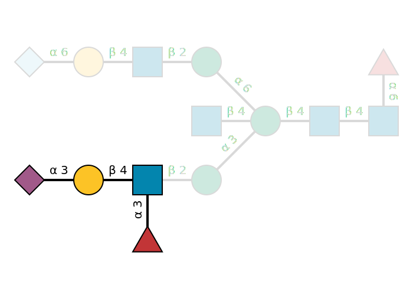

# glycowork

<!-- WARNING: THIS FILE WAS AUTOGENERATED! DO NOT EDIT! -->


[](http://hits.dwyl.com/BojarLab/glycowork)[](https://github.com/BojarLab/glycowork/issues)


Glycans are a fundamental biological sequence, similar to DNA, RNA, or
proteins. Glycans are complex carbohydrates that can form branched
structures comprising monosaccharides and linkages as constituents.
Despite being conspicuously absent from most research, glycans are
ubiquitous in biology. They decorate most proteins and lipids and direct
the stability and functions of biomolecules, cells, and organisms. This
also makes glycans relevant to every human disease.

The analysis of glycans is made difficult by their nonlinearity and
their astounding diversity, given the large number of monosaccharides
and types of linkages. `Glycowork` is a Python package designed to
process and analyze glycan sequences, with a special emphasis on
glycan-focused data science and machine learning. Next to various
functions to work with glycans, `glycowork` also contains glycan data
that can be used for model training, motif comparisons, etc. Glycowork
uses human-readable IUPAC-condensed (e.g.,
`Neu5Ac(a2-3)Gal(b1-3)[Neu5Ac(a2-6)]GalNAc`) as a user-facing string
representation and monosaccharide-level graphs as a powerful
behind-the-scenes architecture.

If you use `glycowork` or any of our datasets in your project, please
cite [Thomes et al.,
2021](https://academic.oup.com/glycob/advance-article/doi/10.1093/glycob/cwab067/6311240).

The full documentation for `glycowork` can be found here:
https://bojarlab.github.io/glycowork/

If you want to contribute to `glycowork`, the best place to start is to
read our [contribution
guidelines](https://github.com/BojarLab/glycowork/blob/master/CONTRIBUTING.md).

## Install

via pip: <br> `pip install glycowork` <br> `import glycowork`

alternative: <br>
`pip install git+https://github.com/BojarLab/glycowork.git` <br>
`import glycowork`

Note that we have optional extra installs for specialized use (even
further instructions can be found in the `Examples` tab), such as: <br>
*deep learning* <br> `pip install glycowork[ml]` <br> *drawing glycan
images with GlycoDraw* <br> `pip install glycowork[draw]` <br>
*analyzing atomic/chemical properties of glycans* <br>
`pip install glycowork[chem]` <br> *everything* <br>
`pip install glycowork[all]` <br>

## Data & Models

`Glycowork` currently contains the following main datasets that are
freely available to everyone:

- **`df_glycan`**
  - contains ~50,000 unique glycan sequences, including labels such as
    ~35,000 species associations, ~14,000 tissue associations, and
    ~1,000 disease associations
- **`glycan_binding`**
  - contains \>550,000 protein-glycan binding interactions, from 1,392
    unique glycan-binding proteins

Additionally, we store these trained deep learning models for easy
usage, which can be retrieved with the `prep_model` function:

- **`LectinOracle`**
  - can be used to predict glycan-binding specificity of a protein,
    given its ESM-1b representation; from [Lundstrom et al.,
    2021](https://onlinelibrary.wiley.com/doi/10.1002/advs.202103807)
- **`LectinOracle_flex`**
  - operates the same as LectinOracle but can directly use the raw
    protein sequence as input (no ESM-1b representation required)
- **`SweetNet`**
  - a graph convolutional neural network trained to predict species from
    glycan, can be used to generate learned glycan representations; from
    [Burkholz et al., 2021](https://pubmed.ncbi.nlm.nih.gov/34133929/)
- **`NSequonPred`**
  - given the ESM-1b representation of an N-sequon (+/- 20 AA), this
    model can predict whether the sequon will be glycosylated

## How to use

`Glycowork` currently contains four main modules:

- **`glycan_data`**
  - stores several glycan datasets and contains helper functions
- **`ml`**
  - here are all the functions for training and using machine learning
    models, including train-test-split, getting glycan representations,
    etc.
- **`motif`**
  - contains functions for processing & drawing glycan sequences,
    identifying motifs and features, and analyzing them
- **`network`**
  - contains functions for constructing and analyzing glycan networks
    (e.g., biosynthetic networks)

Below are some examples of what you can do with `glycowork`; be sure to
check out the other `examples` in the full documentation for everything
that’s there. A non-exhaustive list includes:

- using trained AI models for prediction
- training your own AI models
- motif enrichment analyses
- annotating motifs in glycans
- drawing publication-quality glycan figures
- finding out whether & where glycans are describing the same sequence
- m/z to composition to structure to motif mappings
- mass calculation
- visualizing motif distribution / glycan similarities / sequence
  properties
- constructing and analyzing biosynthetic networks

``` python
#drawing publication-quality glycan figures
from glycowork.motif.draw import GlycoDraw
GlycoDraw("Neu5Ac(a2-3)Gal(b1-4)[Fuc(a1-3)]GlcNAc(b1-2)Man(a1-3)[Neu5Gc(a2-6)Gal(b1-4)GlcNAc(b1-2)Man(a1-6)][GlcNAc(b1-4)]Man(b1-4)GlcNAc(b1-4)[Fuc(a1-6)]GlcNAc")
```



``` python
#get motifs, graph features, and sequence features of a set of glycan sequences to train models or analyze glycan properties
glycans = ['Man(a1-3)[Man(a1-6)][Xyl(b1-2)]Man(b1-4)GlcNAc(b1-4)[Fuc(a1-3)]GlcNAc',
           'Man(a1-2)Man(a1-2)Man(a1-3)[Man(a1-3)Man(a1-6)]Man(b1-4)GlcNAc(b1-4)GlcNAc',
           'GalNAc(a1-4)GlcNAcA(a1-4)[GlcN(b1-7)]Kdo(a2-5)[Kdo(a2-4)]Kdo(a2-6)GlcN4P(b1-6)GlcN1P']
from glycowork.motif.annotate import annotate_dataset
out = annotate_dataset(glycans, feature_set = ['known', 'graph', 'exhaustive']).head()
```

|                                                                                          | LewisX | LewisY | SialylLewisX | SulfoSialylLewisX | LewisA | LewisB | SialylLewisA | SulfoLewisA | H_type2 | H_type1 | A_antigen | B_antigen | Galili_antigen | GloboH | Gb5 | Gb4 | Gb3 | 3SGb3 | 8DSGb3 | 3SGb4 | 8DSGb4 | 6DSGb4 | 3SGb5 | 8DSGb5 | 6DSGb5 | 6DSGb5_2 | 6SGb3 | 8DSGb3_2 | 6SGb4 | 8DSGb4_2 | 6SGb5 | 8DSGb5_2 | 66DSGb5 | Forssman_antigen | iGb3 | I_antigen | i_antigen | PI_antigen | Chitobiose | Trimannosylcore | Internal_LacNAc_type1 | Terminal_LacNAc_type1 | Internal_LacNAc_type2 | Terminal_LacNAc_type2 | Internal_LacdiNAc_type1 | Terminal_LacdiNAc_type1 | Internal_LacdiNAc_type2 | Terminal_LacdiNAc_type2 | bisectingGlcNAc | VIM | PolyLacNAc | Ganglio_Series | Lacto_Series(LewisC) | NeoLacto_Series | betaGlucan | KeratanSulfate | Hyluronan | Mollu_series | Arthro_series | Cellulose_like | Chondroitin_4S | GPI_anchor | Isoglobo_series | LewisD | Globo_series | Sda | SDA | Muco_series | Heparin | Peptidoglycan | Dermatansulfate | CAD | Lactosylceramide | Lactotriaosylceramide | LexLex | GM3 | H_type3 | GM2 | GM1 | cisGM1 | VIM2 | GD3 | GD1a | GD2 | GD1b | SDLex | Nglycolyl_GM2 | Fuc_LN3 | GT1b | GD1 | GD1a_2 | LcGg4 | GT3 | Disialyl_T_antigen | GT1a | GT2 | GT1c | 2Fuc_GM1 | GQ1c | O_linked_mannose | GT1aa | GQ1b | HNK1 | GQ1ba | O_mannose_Lex | 2Fuc_GD1b | Sialopentaosylceramide | Sulfogangliotetraosylceramide | B-GM1 | GQ1aa | bisSulfo-Lewis x | para-Forssman | core_fucose | core_fucose(a1-3) | GP1c | B-GD1b | GP1ca | Isoglobotetraosylceramide | polySia | high_mannose | Gala_series | LPS_core | Nglycan_complex | Nglycan_complex2 | Oglycan_core1 | Oglycan_core2 | Oglycan_core3 | Oglycan_core4 | Oglycan_core5 | Oglycan_core6 | Oglycan_core7 | Xylogalacturonan | Sialosylparagloboside | LDNF | OFuc | Arabinogalactan_type2 | EGF_repeat | Nglycan_hybrid | Arabinan | Xyloglucan | Acharan_Sulfate | M3FX | M3X | 1-6betaGalactan | Arabinogalactan_type1 | Galactomannan | Tetraantennary_Nglycan | Mucin_elongated_core2 | Fucoidan | Alginate | FG  | XX  | Difucosylated_core | GalFuc_core | diameter | branching | nbrLeaves | avgDeg   | varDeg   | maxDeg | nbrDeg4 | max_deg_leaves | mean_deg_leaves | deg_assort    | betweeness | betwVar  | betwMax  | eigenMax | eigenMin | eigenAvg | eigenVar | closeMax | closeMin | closeAvg | closeVar | flowMax  | flowAvg  | flowVar  | flow_edgeMax | flow_edgeMin | flow_edgeAvg | flow_edgeVar | loadMax  | loadAvg  | loadVar  | harmMax  | harmMin  | harmAvg  | harmVar  | secorderMax | secorderMin | secorderAvg | secorderVar | size_corona | size_core | nbr_node_types | egap     | entropyStation | N    | dens | Fuc | GalNAc | GlcN | GlcN1P | GlcN4P | GlcNAc | GlcNAcA | Kdo | Man | Xyl | Man(a1-3)Man | Man(a1-6)Man | Xyl(b1-2)Man | Man(b1-4)GlcNAc | GlcNAc(b1-4)GlcNAc | Fuc(a1-3)GlcNAc | Man(a1-2)Man | GalNAc(a1-4)GlcNAcA | GlcNAcA(a1-4)Kdo | GlcN(b1-7)Kdo | Kdo(a2-5)Kdo | Kdo(a2-4)Kdo | Kdo(a2-6)GlcN4P | GlcN4P(b1-6)GlcN1P | Man(a1-?)Man | Kdo(a2-?)Kdo |
|------------------------------------------------------------------------------------------|--------|--------|--------------|-------------------|--------|--------|--------------|-------------|---------|---------|-----------|-----------|----------------|--------|-----|-----|-----|-------|--------|-------|--------|--------|-------|--------|--------|----------|-------|----------|-------|----------|-------|----------|---------|------------------|------|-----------|-----------|------------|------------|-----------------|-----------------------|-----------------------|-----------------------|-----------------------|-------------------------|-------------------------|-------------------------|-------------------------|-----------------|-----|------------|----------------|----------------------|-----------------|------------|----------------|-----------|--------------|---------------|----------------|----------------|------------|-----------------|--------|--------------|-----|-----|-------------|---------|---------------|-----------------|-----|------------------|-----------------------|--------|-----|---------|-----|-----|--------|------|-----|------|-----|------|-------|---------------|---------|------|-----|--------|-------|-----|--------------------|------|-----|------|----------|------|------------------|-------|------|------|-------|---------------|-----------|------------------------|-------------------------------|-------|-------|------------------|---------------|-------------|-------------------|------|--------|-------|---------------------------|---------|--------------|-------------|----------|-----------------|------------------|---------------|---------------|---------------|---------------|---------------|---------------|---------------|------------------|-----------------------|------|------|-----------------------|------------|----------------|----------|------------|-----------------|------|-----|-----------------|-----------------------|---------------|------------------------|-----------------------|----------|----------|-----|-----|--------------------|-------------|----------|-----------|-----------|----------|----------|--------|---------|----------------|-----------------|---------------|------------|----------|----------|----------|----------|----------|----------|----------|----------|----------|----------|----------|----------|----------|--------------|--------------|--------------|--------------|----------|----------|----------|----------|----------|----------|----------|-------------|-------------|-------------|-------------|-------------|-----------|----------------|----------|----------------|------|------|-----|--------|------|--------|--------|--------|---------|-----|-----|-----|--------------|--------------|--------------|-----------------|--------------------|-----------------|--------------|---------------------|------------------|---------------|--------------|--------------|-----------------|--------------------|--------------|--------------|
| Man(a1-3)\[Man(a1-6)\]\[Xyl(b1-2)\]Man(b1-4)GlcNAc(b1-4)\[Fuc(a1-3)\]GlcNAc              | 0      | 0      | 0            | 0                 | 0      | 0      | 0            | 0           | 0       | 0       | 0         | 0         | 0              | 0      | 0   | 0   | 0   | 0     | 0      | 0     | 0      | 0      | 0     | 0      | 0      | 0        | 0     | 0        | 0     | 0        | 0     | 0        | 0       | 0                | 0    | 0         | 0         | 0          | 1          | 1               | 0                     | 0                     | 0                     | 0                     | 0                       | 0                       | 0                       | 0                       | 0               | 0   | 0          | 0              | 0                    | 0               | 0          | 0              | 0         | 0            | 0             | 0              | 0              | 0          | 0               | 0      | 0            | 0   | 0   | 0           | 0       | 0             | 0               | 0   | 0                | 0                     | 0      | 0   | 0       | 0   | 0   | 0      | 0    | 0   | 0    | 0   | 0    | 0     | 0             | 0       | 0    | 0   | 0      | 0     | 0   | 0                  | 0    | 0   | 0    | 0        | 0    | 0                | 0     | 0    | 0    | 0     | 0             | 0         | 0                      | 0                             | 0     | 0     | 0                | 0             | 0           | 1                 | 0    | 0      | 0     | 0                         | 0       | 0            | 0           | 0        | 0               | 0                | 0             | 0             | 0             | 0             | 0             | 0             | 0             | 0                | 0                     | 0    | 0    | 0                     | 0          | 0              | 0        | 0          | 0               | 0    | 0   | 0               | 0                     | 0             | 0                      | 0                     | 0        | 0        | 0   | 0   | 0                  | 0           | 8.0      | 1.0       | 4.0       | 1.846154 | 0.591716 | 4.0    | 1.0     | 4.0            | 4.0             | -3.448276e-02 | 0.240093   | 0.051241 | 0.727273 | 0.337083 | 0.251423 | 0.276471 | 0.000487 | 0.400000 | 0.181818 | 0.288591 | 0.003994 | 0.727273 | 0.240093 | 0.051241 | 0.318182     | 0.090909     | 0.179293     | 0.006460     | 0.727273 | 0.240093 | 0.051241 | 6.950000 | 3.253571 | 4.820330 | 0.908780 | 66.603303   | 26.305893   | 44.589784   | 127.751200  | 4.0         | 13.0      | 13.0           | 0.057103 | -2.075921      | 13.0 | 12.0 | 1   | 0      | 2    | 0      | 0      | 2      | 0       | 0   | 3   | 1   | 1            | 1            | 1            | 1               | 1                  | 1               | 0            | 0                   | 0                | 0             | 0            | 0            | 0               | 0                  | 2            | 0            |
| Man(a1-2)Man(a1-2)Man(a1-3)\[Man(a1-3)Man(a1-6)\]Man(b1-4)GlcNAc(b1-4)GlcNAc             | 0      | 0      | 0            | 0                 | 0      | 0      | 0            | 0           | 0       | 0       | 0         | 0         | 0              | 0      | 0   | 0   | 0   | 0     | 0      | 0     | 0      | 0      | 0     | 0      | 0      | 0        | 0     | 0        | 0     | 0        | 0     | 0        | 0       | 0                | 0    | 0         | 0         | 0          | 1          | 1               | 0                     | 0                     | 0                     | 0                     | 0                       | 0                       | 0                       | 0                       | 0               | 0   | 0          | 0              | 0                    | 0               | 0          | 0              | 0         | 0            | 0             | 0              | 0              | 0          | 0               | 0      | 0            | 0   | 0   | 0           | 0       | 0             | 0               | 0   | 0                | 0                     | 0      | 0   | 0       | 0   | 0   | 0      | 0    | 0   | 0    | 0   | 0    | 0     | 0             | 0       | 0    | 0   | 0      | 0     | 0   | 0                  | 0    | 0   | 0    | 0        | 0    | 0                | 0     | 0    | 0    | 0     | 0             | 0         | 0                      | 0                             | 0     | 0     | 0                | 0             | 0           | 0                 | 0    | 0      | 0     | 0                         | 0       | 0            | 0           | 0        | 0               | 0                | 0             | 0             | 0             | 0             | 0             | 0             | 0             | 0                | 0                     | 0    | 0    | 0                     | 0          | 0              | 0        | 0          | 0               | 0    | 0   | 0               | 0                     | 0             | 0                      | 0                     | 0        | 0        | 0   | 0   | 0                  | 0           | 10.0     | 1.0       | 3.0       | 1.866667 | 0.248889 | 3.0    | 0.0     | 3.0            | 3.0             | -2.331468e-15 | 0.263004   | 0.037282 | 0.703297 | 0.288267 | 0.234925 | 0.257853 | 0.000179 | 0.341463 | 0.157303 | 0.238951 | 0.003059 | 0.703297 | 0.263004 | 0.037282 | 0.296703     | 0.076923     | 0.182104     | 0.005067     | 0.703297 | 0.263004 | 0.037282 | 6.616667 | 3.407937 | 4.921958 | 0.799295 | 70.823725   | 26.381812   | 48.985176   | 174.452553  | 3.0         | 15.0      | 15.0           | 0.031066 | -2.658737      | 15.0 | 14.0 | 0   | 0      | 2    | 0      | 0      | 2      | 0       | 0   | 6   | 0   | 2            | 1            | 0            | 1               | 1                  | 0               | 2            | 0                   | 0                | 0             | 0            | 0            | 0               | 0                  | 5            | 0            |
| GalNAc(a1-4)GlcNAcA(a1-4)\[GlcN(b1-7)\]Kdo(a2-5)\[Kdo(a2-4)\]Kdo(a2-6)GlcN4P(b1-6)GlcN1P | 0      | 0      | 0            | 0                 | 0      | 0      | 0            | 0           | 0       | 0       | 0         | 0         | 0              | 0      | 0   | 0   | 0   | 0     | 0      | 0     | 0      | 0      | 0     | 0      | 0      | 0        | 0     | 0        | 0     | 0        | 0     | 0        | 0       | 0                | 0    | 0         | 0         | 0          | 0          | 0               | 0                     | 0                     | 0                     | 0                     | 0                       | 0                       | 0                       | 0                       | 0               | 0   | 0          | 0              | 0                    | 0               | 0          | 0              | 0         | 0            | 0             | 0              | 0              | 0          | 0               | 0      | 0            | 0   | 0   | 0           | 0       | 0             | 0               | 0   | 0                | 0                     | 0      | 0   | 0       | 0   | 0   | 0      | 0    | 0   | 0    | 0   | 0    | 0     | 0             | 0       | 0    | 0   | 0      | 0     | 0   | 0                  | 0    | 0   | 0    | 0        | 0    | 0                | 0     | 0    | 0    | 0     | 0             | 0         | 0                      | 0                             | 0     | 0     | 0                | 0             | 0           | 0                 | 0    | 0      | 0     | 0                         | 0       | 0            | 0           | 0        | 0               | 0                | 0             | 0             | 0             | 0             | 0             | 0             | 0             | 0                | 0                     | 0    | 0    | 0                     | 0          | 0              | 0        | 0          | 0               | 0    | 0   | 0               | 0                     | 0             | 0                      | 0                     | 0        | 0        | 0   | 0   | 0                  | 0           | 10.0     | 2.0       | 4.0       | 1.866667 | 0.382222 | 3.0    | 0.0     | 4.0            | 4.0             | -1.449275e-02 | 0.239560   | 0.044684 | 0.615385 | 0.287575 | 0.234359 | 0.257668 | 0.000274 | 0.350000 | 0.172840 | 0.255611 | 0.003247 | 0.615385 | 0.239560 | 0.044684 | 0.307692     | 0.076923     | 0.169545     | 0.006240     | 0.615385 | 0.239560 | 0.044684 | 6.616667 | 3.563492 | 5.083122 | 0.950051 | 66.992537   | 28.248894   | 47.236515   | 150.711681  | 4.0         | 15.0      | 15.0           | 0.013600 | -2.688625      | 15.0 | 14.0 | 0   | 1      | 4    | 1      | 1      | 1      | 1       | 3   | 0   | 0   | 0            | 0            | 0            | 0               | 0                  | 0               | 0            | 1                   | 1                | 1             | 1            | 1            | 1               | 1                  | 0            | 2            |

``` python
#using graphs, you can easily check whether two glycans are the same - even if they use different bracket notations!
from glycowork.motif.graph import compare_glycans
print(compare_glycans('Man(a1-3)[Man(a1-6)]Man(b1-4)GlcNAc(b1-4)[Fuc(a1-6)]GlcNAc',
                     'Man(a1-6)[Man(a1-3)]Man(b1-4)GlcNAc(b1-4)[Fuc(a1-6)]GlcNAc'))
print(compare_glycans('Man(a1-3)[Man(a1-6)]Man(b1-4)GlcNAc(b1-4)[Fuc(a1-6)]GlcNAc',
                     'Man(a1-6)[Man(a1-3)]Man(b1-4)GlcNAc(b1-4)GlcNAc'))

#or you could find the terminal structures of a glycan
from glycowork.motif.annotate import get_terminal_structures
print("\nTerminal structures:")
print(get_terminal_structures('Man(a1-3)[Man(a1-6)]Man(b1-4)GlcNAc(b1-4)[Fuc(a1-6)]GlcNAc'))
```

    True
    False

    Terminal structures:
    ['Man(a1-3)', 'Man(a1-6)', 'Fuc(a1-6)']

``` python
#given a composition, find matching glycan structures in SugarBase; specific for glycan classes and taxonomy
from glycowork.motif.tokenization import compositions_to_structures
print(compositions_to_structures([{'Hex':3, 'HexNAc':4}], glycan_class = 'N'))

#or we could calculate the mass of this composition
from glycowork.motif.tokenization import composition_to_mass
print("\nMass of the composition Hex3HexNAc4")
print(composition_to_mass({'Hex':3, 'HexNAc':4}))
```

    0 compositions could not be matched. Run with verbose = True to see which compositions.
                                                   glycan  abundance
    0   GalNAc(b1-4)GlcNAc(b1-2)Man(a1-3)[Man(a1-6)]Ma...          0
    1   GlcNAc(b1-2)Man(a1-3)[GlcNAc(b1-2)Man(a1-6)]Ma...          0
    2   GlcNAc(b1-2)Man(a1-3)[GlcNAc(b1-2)Man(a1-6)][G...          0
    3   GlcNAc(b1-2)Man(a1-3)[GlcNAc(b1-2)[GlcNAc(b1-4...          0
    4   GlcNAc(b1-2)Man(a1-3)[GlcNAc(b1-4)][Man(a1-6)]...          0
    5   GlcNAc(b1-2)Man(a1-3)[GlcNAc(b1-6)Man(a1-6)]Ma...          0
    6   GlcNAc(b1-4)Man(a1-3)[GlcNAc(b1-6)Man(a1-6)]Ma...          0
    7   GlcNAc(b1-2)Man(a1-6)[Man(a1-3)][GlcNAc(b1-4)]...          0
    8   Man(a1-3)[GlcNAc(b1-4)][GlcNAc(b1-2)Man(a1-6)]...          0
    9   GlcNAc(b1-2)[GlcNAc(b1-4)]Man(a1-3)[GlcNAc(b1-...          0
    10  GlcNAc(b1-2)[GlcNAc(b1-4)]Man(a1-3)[Man(a1-6)]...          0
    11  GlcNAc(b1-4)Man(a1-3)[GlcNAc(b1-2)Man(a1-6)]Ma...          0
    12  GlcNAc(?1-?)Man(a1-3)[GlcNAc(?1-?)Man(a1-6)]Ma...          0
    13  HexNAc(?1-?)GlcNAc(b1-2)Man(a1-3)[Man(a1-6)]Ma...          0
    14  Man(a1-3)[GlcNAc(b1-2)[GlcNAc(b1-6)]Man(a1-6)]...          0
    15  GalNAc(b1-4)GlcNAc(b1-2)Man(a1-6)[Man(a1-3)]Ma...          0

    Mass of the composition Hex3HexNAc4
    1316.4865545999999
